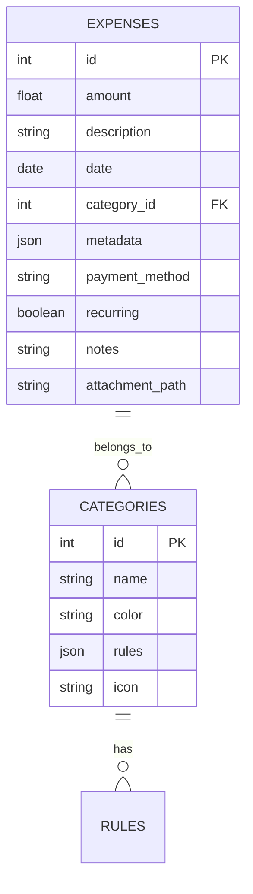

# Expense Manager Personale - Piano di Sviluppo

## 1. Visione del Progetto

L'obiettivo è creare un'applicazione personale per la gestione delle spese che permetta di tracciare, categorizzare e analizzare le proprie spese in modo efficiente. Il progetto serve come opportunità di apprendimento e crescita tecnica, seguendo un percorso graduale che permetta di acquisire competenze mentre si costruisce qualcosa di utile per la gestione finanziaria personale.

## 2. Stack Tecnologico

### Backend (Python Ecosystem)
- **Framework**: FastAPI
  - Moderno e facile da imparare
  - Eccellente documentazione
  - Performance elevate
  - Tipo-sicuro grazie a Pydantic

- **Database**: SQLite
  - Perfetto per uso personale
  - Zero configurazione
  - File singolo, facile da backuppare
  - Possibilità futura di migrare a PostgreSQL

- **ORM**: SQLAlchemy
  - Standard de facto in Python
  - Ottimo per imparare i concetti di ORM
  - Flessibile e potente

### Frontend
- **Framework**: React
  - Ampia comunità e risorse di apprendimento
  - Componenti riutilizzabili
  - Ottimo per imparare lo sviluppo frontend moderno

- **Styling**: 
  - Tailwind CSS (utility-first approach)
  - Componenti precostruiti da Tailwind UI

- **Visualizzazione Dati**: 
  - Chart.js per grafici
  - React-Table per tabelle di dati

## 3. Schema Database

## 4. Percorso di Sviluppo e Apprendimento

| Ordine | Task | Competenze da Acquisire | Tempo Stimato | Difficoltà |
|--------|------|------------------------|---------------|------------|
| 1 | Setup ambiente Python e progetto base | Virtual env, git, struttura progetto | 2 giorni | Bassa |
| 2 | Implementazione modello dati base | SQLAlchemy, modelli di dati, migrations | 3 giorni | Media |
| 3 | API CRUD spese con FastAPI | REST API, FastAPI, Pydantic | 4 giorni | Media |
| 4 | Setup React e prima UI | React basics, componenti, props, state | 5 giorni | Media |
| 5 | Form inserimento spese | Form handling, validazione, UI/UX | 3 giorni | Media |
| 6 | Visualizzazione lista spese | React hooks, tabelle, filtri | 4 giorni | Media |
| 7 | Sistema categorie | Relazioni database, CRUD avanzato | 3 giorni | Media |
| 8 | Dashboard con grafici | Chart.js, aggregazione dati | 5 giorni | Alta |
| 9 | Export/Import dati | File handling, CSV/Excel processing | 3 giorni | Media |
| 10 | Recurring transactions | Scheduling, automazione | 4 giorni | Alta |
| 11 | Report e analytics | Analisi dati, SQL avanzato | 5 giorni | Alta |

## Tabella delle Task

| Task | Descrizione | Priorità | Tempo Stimato |
|------|------------|----------|--------------|
| Creare ambiente di sviluppo | Setup Flask, DB, virtualenv | 🔴 Alta | 2 giorni |
| Creare database | Strutturare tabelle e relazioni | 🔴 Alta | 3 giorni |
| API REST CRUD | Creare API per gestione spese | 🔴 Alta | 5 giorni |
| Frontend base | HTML/CSS con Flask (Jinja2) | 🔴 Alta | 5 giorni |
| Filtri e ricerca | Aggiungere filtri per data e categoria | 🔵 Media | 4 giorni |
| Budget | Gestire limiti di spesa mensili | 🔵 Media | 4 giorni |
| Grafici | Statistiche con Matplotlib | 🔶 Bassa | 3 giorni |
| Esportazione | CSV e PDF | 🔶 Bassa | 3 giorni |
| Notifiche | Avvisi su superamento budget | 🔵 Media | 3 giorni |
| Testing e Debug | Correggere bug e testare | 🔴 Alta | 4 giorni |
| Deploy | Se necessario, pubblicare online | 🔶 Bassa | 3 giorni |

## 5. Feature Set

### Gestione Spese
- Inserimento rapido spese
- Categorizzazione automatica basata su regole
- Supporto per spese ricorrenti
- Tag e note per migliore organizzazione
- Allegati (scontrini, fatture)

### Analisi e Reporting
- Dashboard personalizzata
- Grafici per trend spese
- Report mensili/annuali
- Analisi per categoria
- Previsioni di spesa basate sui trend storici

### Utilità
- Export dati in CSV/Excel
- Backup automatico database
- Import da file esterni
- Ricerca avanzata spese
- Gestione allegati

## 6. Consigli per lo Sviluppo

1. Inizia dalle funzionalità core (inserimento e visualizzazione spese)
2. Usa git dall'inizio e commita spesso
3. Scrivi test per le funzionalità principali
4. Documenta le decisioni importanti
5. Mantieni un diario di sviluppo per tracciare l'apprendimento
6. Non esitare a rifattorizzare quando capisci approcci migliori

## 7. Resources Utili

### Python/FastAPI
- FastAPI Documentation (https://fastapi.tiangolo.com/)
- SQLAlchemy Tutorial (https://docs.sqlalchemy.org/en/14/tutorial/)
- Python Testing con pytest
- Python Design Patterns

### React/Frontend
- React Official Tutorial
- Tailwind CSS Documentation
- Chart.js Examples
- React Hooks Guide

### Database Design
- SQLite Best Practices
- Database Schema Design
- SQL Performance Tips

## 8. Next Steps Immediati

1. Setup ambiente di sviluppo
   - Installare Python 3.11+
   - Creare virtual environment
   - Installare dipendenze base
   - Setup git repository

2. Creare struttura progetto base
   - Organizzare cartelle
   - Setup FastAPI base
   - Configurare database
   - Prima API di test

3. Iniziare con il modello spese
   - Definire schema base
   - Implementare prime API
   - Testare con Postman/curl

4. Sviluppare prima UI
   - Setup progetto React
   - Creare componente base per lista spese
   - Implementare form inserimento base

